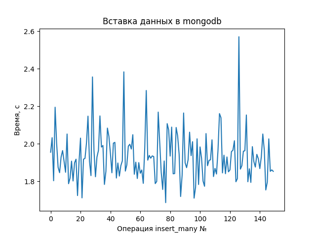
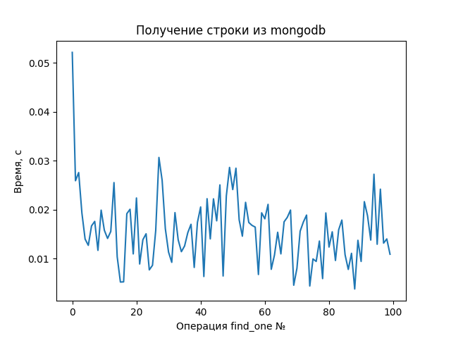
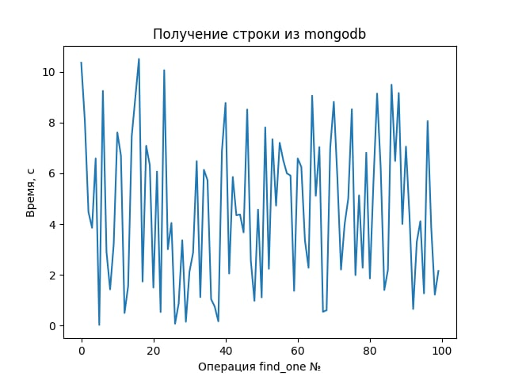
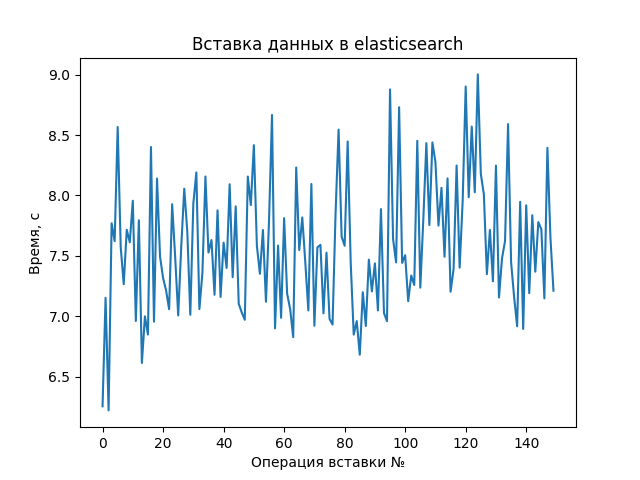
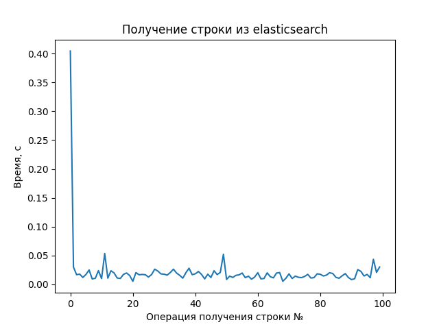

# Сравнение производительности хранилищ

Запуск:
 - Поднять контейнер с mongo: `docker compose up`
 - Установить зависимости (из директории storages_tests): `pip install -r requirements.txt` 
 - Запустить тесты: `python storage_tests.py`

### График с результатами исследования операций записи в mongo

### График с результатами исследования операции считывания из mongo с использованием индекса

### График с результатами исследования операции считывания из mongo без использования индекса

### График с результатами исследования операций записи в elasticsearch

### График с результатами исследования операции считывания из elasticsearch

# Выводы

Mongo db обеспечивает быстрое считывание данных, при условии правильной настройки индексов.
Запись в mongo происходит заметно быстрее, чем в elastic, что наглядно видно на графиках.
Получение данных из обоих хранилищ примерно сопоставимо по скорости.
Есть различия в настройке баз. Mongo предлагает довольно сложную настройку шардирования, но более простой интерфейс 
выполнения запросов. При использовании elasticsearch в последствии сложно будет менять структуру документов.
Оба хранилища удовлетворяют требованию проекта к получению данных < 200 мс.
Mongo подходит для хранения сущностей из проекта (фильмы с отзывами и рецензиями, реакции пользователей).
В качестве хранилища выбираем mongodb.
